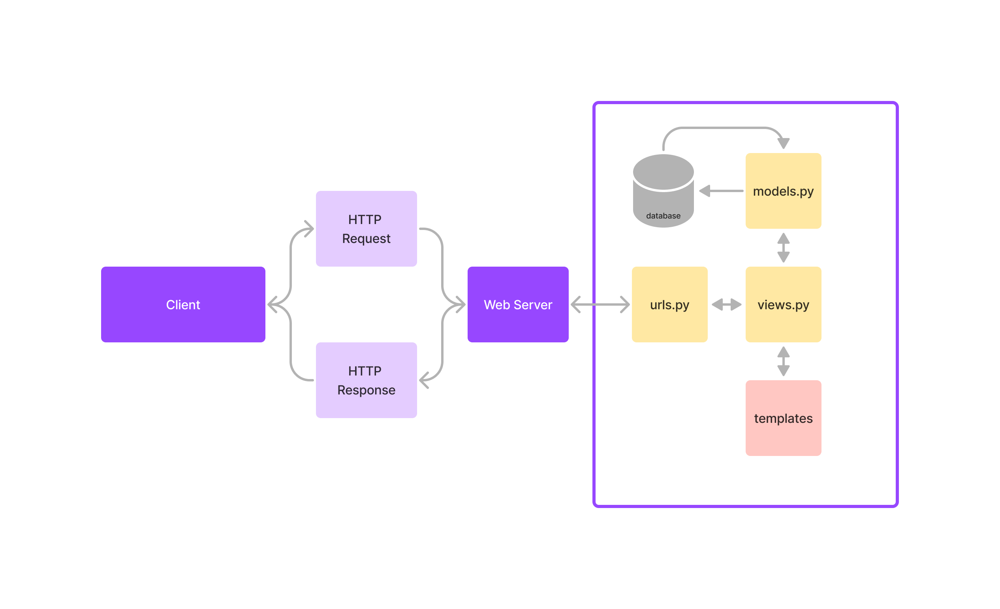
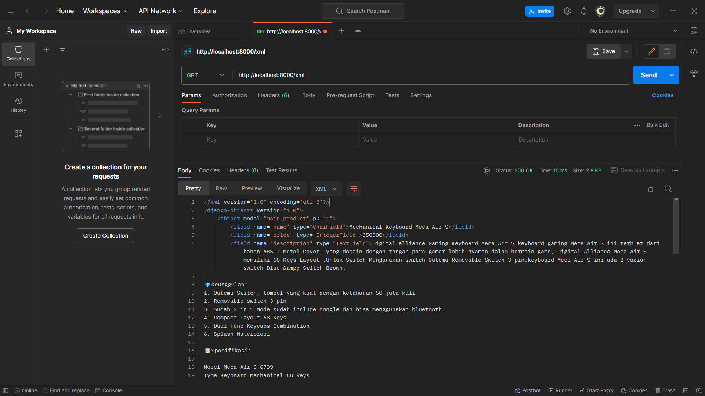
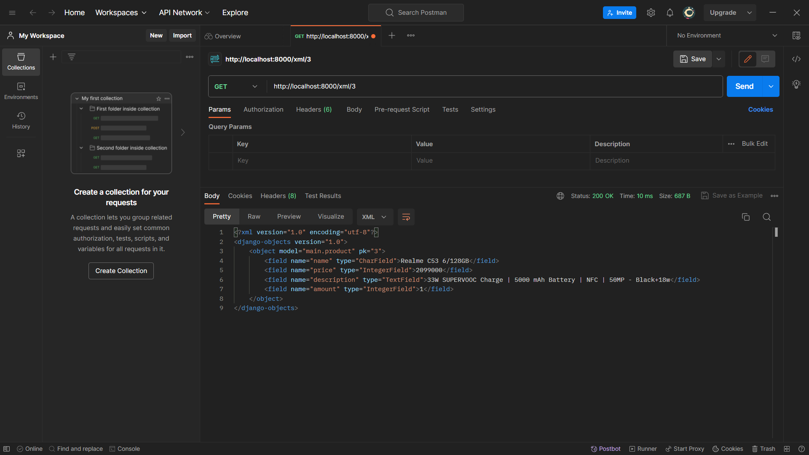
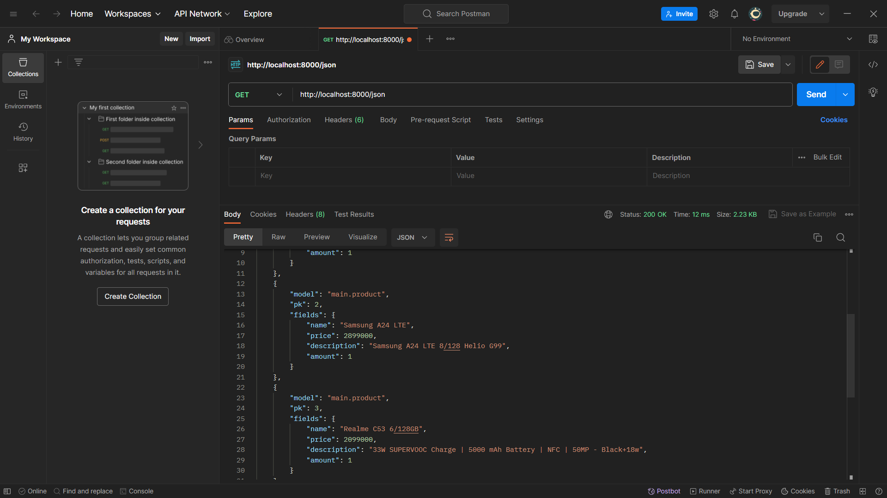
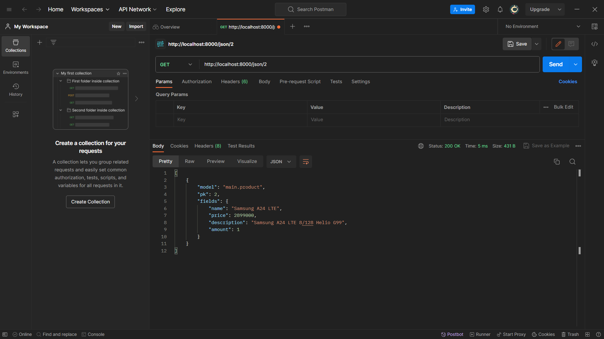

## Table of Content
1. [Tugas 1](#tugas-1)
1. [Tugas 2](#tugas-2)
2. [Tugas 3](#tugas-3)
3. [Tugas 4](#tugas-4)
4. [Tugas 5](#tugas-5)

## Tugas 1
[Contents](#table-of-content)

Essay Scele

## Tugas 2
[Contents](#table-of-content)
### 1. Impelementasi checklist.
Saya pergi ke repository lokal yang berisi tugas PBP dan menyiapkan satu folder untuk tugas-tugas yang berhubungan dengan github pada “PBP/GITHUB Connect”
Saya membuat virtual environment denan command ```python -m venv env```
Saya membuat project django app di dalam GITHUB Connect dengan menggunakan command ```django-admin startproject tokopaedi```


Setelah itu saya masuk ke direktori utama “/tokopaedi” untuk kemudian membuat app baru bernama main dengan menggunakan command ```django-admin startapp main```


Kemudian, saya melakukan setup pada settings.py agar semua HOST dapat mengakses project ini dan juga menginstall app main sehingga terdapat line berikut ini

```python
ALLOWED_HOST = [‘*’]

INSTALLED_APPS = [
    …
    …
   ‘main’,
]
```
Sehingga, app main berhasil di install dalam proyek tokopaedi


Kemudian, saya melakukan setup routing pada app main denganmenambahkan file "urls.py" pada app main sehingga terbentuk file baru "main/urls.py". File tersebut diisi dengan
```python
from django.urls import path
from main.views import show_main

# tugas 2: menjadikan main sebagai app
app_name = 'main'

# url untuk mengakses app main
urlpatterns = [
    path('', show_main, name='show_main'),
]
```
Setelah itu saya membuat path baru pada urls.py yang ada dalam direktori proyek untuk bisa mengakses file urls yang ada dalam app main, dengan menambahkan baris kode
```python
urlpatterns = [
    ...
    path('main/', include('main.urls')),
]
```
Kemudian, saya mempersiapkan models.py pada app main. Saya membuat sebuah class Product yang memiliki atribut name, price, amount, dan juga description. Tampilan class tersebut adalah seperti ini:
```python
class Product(models.Model):
    name = models.CharField(max_length=255)
    price = models.IntegerField()
    amount = models.IntegerField()
    description = models.TextField()
```
Untuk membuat tampilan utama app main saya membuat template dengan menyiapkan direktori baru bernama "main/templates/main" dan akan dibuat satu file main.html.

Langkah selanjutnya adalah mempersiapkan views.py pada app main yang dapat menghubungkan models.py dan juga file template pada "main/templates/main". Pada "main/views.py" saya menambahkan function show_main yang akan mengenerate models yang saya miliki ke "templates/main/main.html"
```python
# tugas 2: function untuk show app main
def show_main(request):
    context = {
        'name': 'Kursi Gaming',
        'price' : '2000000',
        'amount' : '1',
        'description' : 'Kursi Gaming dengan desain menyerupai mobil sport akan meningkatkan kemampuan coding anda sebanyak 250%'
    }
    return render(request, "main.html", context)
```
selanjutnya, saya melakukan migrasi model dengan menjalankan perintah ```python manage.py makemigrations``` dan ```python manage.py migrate```

### 2. Bagan request client ke web aplikasi


Pada bagan tersebut client melakukan request HTTP dan mengirimkannya ke Django melalui browser, request ini akan diarahkan ke tokopedia/urls.py untuk kemudian diteruskan ke views.py yang sesuai dengan request. views.py akan mengambil data melalui models.py dan kemudian me-render hasilnya dengan templates. Setelah proses tersebut selesai, views.py akan me-return HTTP response dan akan diberikan ke browser client.

### 3. Virtual environment
Dengan menggunakan virtual environment pada proyek Django, kita bisa mengeliminasi permasalahan dependency pada berbagai package yang dibutuhkan oleh proyek kita, dengan kata lain segala kebutuhan yang kita download hanya berpengaruh pada environment khusus tersebut dan kita tidak perlu melakukan download berkali-kali. Namun, kita tetap bisa membuat proyek Django tanpa menggunakan virtual environment degnan konsekuensi harus melacak setiap package yang ada dan akan menyusahkan kita sendiri terutama dalam melakukan kolaborasi dengan engineer lain.

### 4. Penjelasan tentang MVC, MVTM, dan MVVM
Baik MVC, MVT, maupun MVVM adalah arsitektur aplikasi yang bertujuan untuk memudahkan developer dalam mengelola aplikasi.
#### a. MVC
MVC adalah arsitektur yang membagi aplikasi menjadi 3 bagian utama yaitu Model, View, dan Controller. Model menjadi bagian yang bertanggung jawab untuk mengatur data yang ada seperti mengubah data sesuai dengan kebutuhan yang ada dan mengambil data dari database. View bertanggung jawab untuk mengatur tampilan aplikasi, biasanya berbentuk .html dalam web development. Controller bertanggung jawab untuk mengatur seluruh flow aplikasi terutama bagaimana data yang diberikan oleh Model dapat diteruskan ke View.
#### b. MVT
MVT adalah arsitektur yang membagi aplikasi menjadi 3 bagian utama yaitu Model, View, dan Template. Model pada MVT memiliki karakter yang sama dengan model pada MVC. View pada arsitektur MVT memiliki karakteristikk yang serupa dengan Controller pada arsitektur MVC. Sedangkan template, memiliki tanggung jawab yang sama dengan view pada MVC.
#### c. MVVM
MVVM adalah arsitektur yang membagi aplikasi menjadi 3 bagian utama yaitu Model, View, dan ViewModel. Dalam arsitektur MVVM, Model bertugas untuk mengelola logika bisnis yang ada, lalu ViewModel akan mengelola logika bisnis yang ada dan meneruskannya pada View untuk ditampilkan ke pengguna.

Perbedaan ketiganya adalah pada Impelemntasi pengelolaan arsitekturnya. Pada MVC, controller hanya bertugas untuk menghubungkan Model dan juga View. Pada MVT, View bertugas menerima HTTP request dan mengembalikan HTTP response. Pada MVVM fungsionalitas elemen pada View diatur sedemikian rupa oleh ViewModel.

## Tugas 3
[Contents](#table-of-content)
### 1. Perbedaan antara form `POST` dan `GET`

Perbedaan utama dari POST dan GET adalah tujuan dari implementasinya. Method POST digunakan untuk memasukkan data dari suatu form ke dalam server. Method POST juga mengirimkan datanya melalui request. Sehingga cocok untuk data yang penting seperti informasi password. Method GET umumnya digunakan untuk mengambil data dari server dan akan ditampilkan ke pengguna melalui URL, sehingga tidak cocok digunakan untuk mengambil data sensitif seperti password, karena akan terlihat di layar komputer.

### 2. Perbedaan utama antara XML, JSON, dan HTML dalam konteks pengiriman data

Perbedaan utama ketiga format tersebut adalah pada struktur data yang ditampilkan. XML menampilkan data sebagai susunan hirarkis dan menggunakan tag pembuka dan penutup untuk menampilkan data. JSON merepresentasikan data dengan menjadikannya sebagai object dan menampilkannya sebagai suatu key and value juga array. HTML menggunakan data untuk menampilkannya dalam tampilan website, HTML menggunakan tag pembuka dan penutup untuk setiap elemen yang ada dan bisa dilihat sebagai suatu susunan hirarkis keluarga, HTML tidak digunakan secara khusus dalam pengiriman data, tetapi digunakan untuk menampilkannya di layar komputer pengguna.

### 3. Alasan JSON sering digunakan dalam pertukaran data antara aplikasi web modern
Salah satu alasannya adalah JSON menggunakan format text yang dapat dipahami, sehingga engineer dapat dengan mudah memperbaiki kesalahan atau error yang ada. Alasan selanjutnya adalah JSON memiliki format data yang ringan, sehingga lebih efisien. JSON juga didukung banyak bahasa pemrograman sehingga secara tidak langsung memperbanyak penggunanya.

### 4. Impelementasi _checklist_
#### a. Membuat input `form` untuk menambahkan objek model pada app sebelumnya.
* Langkah pertama yang saya lakukan adalah dengan membuat file `forms.py` pada app main dan membuat class baru bernama `ProductForm` yang memiliki argumen `ModelForm`. Kemudian membuat inner class Meta dengan atribut model yang merupakan objek model `Product` dan fields yang akan dibuat dalam `ModelForm`.
* Selanjutnya, pada `views.py`, saya mengimplementasikan form yang ada melalui views untuk ditampilkan ke template yang sesuai. Cara mengimplementasikannya adalah dengan membuat function `create_product` yang akan mengembalikan form yang sudah valid ke dalam template yang sesuai.
#### b. Menambahkan 5 fungsi views untuk melihat objek yang sudah ditambahkan dalam format HTML, XML, JSON, XML by ID, dan JSON by ID.

* Saya menampilkan object product yang ditambahkan dengan format HTML menggunakan function show_main dengan menggunakan variable `products = Product.objects.all()` menjadi salah satu input (context) saat dikirimkan ke template yang sesuai. Pada template main.html, saya melakukan _looping_ untuk menampilkan setiap product dan data yang dimilikinya.

* Saya menampilkan object product yang ditambahkan dengan format XML dengan menambahkan fungsi baru dalam views.py yaitu show_xml dengan parameter request. Kemudian saya mengambil keseluruhan data dari Products untuk kemudian dijadikan argumen HttpResponse menggunakan Serializer yang sesuai. Untuk tampilan product dengan id tertentu, saya menggunakan fungsi yang serupa namun ditambahkan 1 parameter yaitu id. Argumen yang diberikan akan digunakan untuk menyaring data yang ada dalam Products sesuai dengan id yang diberikan.

* Pada format json, langkah yang saya lakukan sama dengan langkah untuk menampilkan data dengan format XML hanya saya, argumen 'xml' diganti dengan 'json' untuk bisa mendapatkan data dengan format json.

#### c. Membuat routing URL untuk masing-masing views yang telah ditambahkan pada poin 2.
* Pada format HTML, routing yang saya memanfaatkan urls main. Sehingga, tidak ada perubahan
* Dalam format XML dan JSON yang menampilkan keseluruhan data, saya menambahkan url yang sesuai untuk bisa menampilkan fungsi show yang berkaitan. Sedangkan untuk format yang menampilkan id tertentu, saya menggunakan `<int:id>/` sebagai url untuk bisa mendapatkan id yang akan dikirim ke fungsi show by id yang bersesuaian.

### 5. Mengakses kelima URL di poin 2 menggunakan Postman, membuat screenshot dari hasil akses URL pada Postman, dan menambahkannya ke dalam `README.md`
#### a. HTML

#### b. XML

#### c. XML by id

#### d. JSON

#### e. JSON by id


## Tugas 4
[Contents](#table-of-content)

### 1. Apa itu Django UserCreationForm, dan jelaskan apa kelebihan dan kekurangannya?

### 2. Apa perbedaan antara autentikasi dan otorisasi dalam konteks Django, dan mengapa keduanya penting?

### 3. Apa itu cookies dalam konteks aplikasi web, dan bagaimana Django menggunakan cookies untuk mengelola data sesi pengguna?

### 4. Apakah penggunaan cookies aman secara default dalam pengembangan web, atau apakah ada risiko potensial yang harus diwaspadai?

### 5. Implementasi Checklist

#### a. Mengimplementasikan fitur registrasi, login, dan logout

#### b. Membuat dua akun pengguna dengan masing-masing **3** *dummy data* menggunakan model yang telah dibuat pada aplikasi sebelumnya setiap akun **di lokal**

#### c. Menghubungkan model `Item` dengan `User`

#### d. Menampilkan detail informasi pengguna yang sedang *logged in* seperti *username* dan menerapkan `cookies` seperti `last login` pada halaman utama aplikasi.

## Tugas 5
[Contents](#table-of-content)