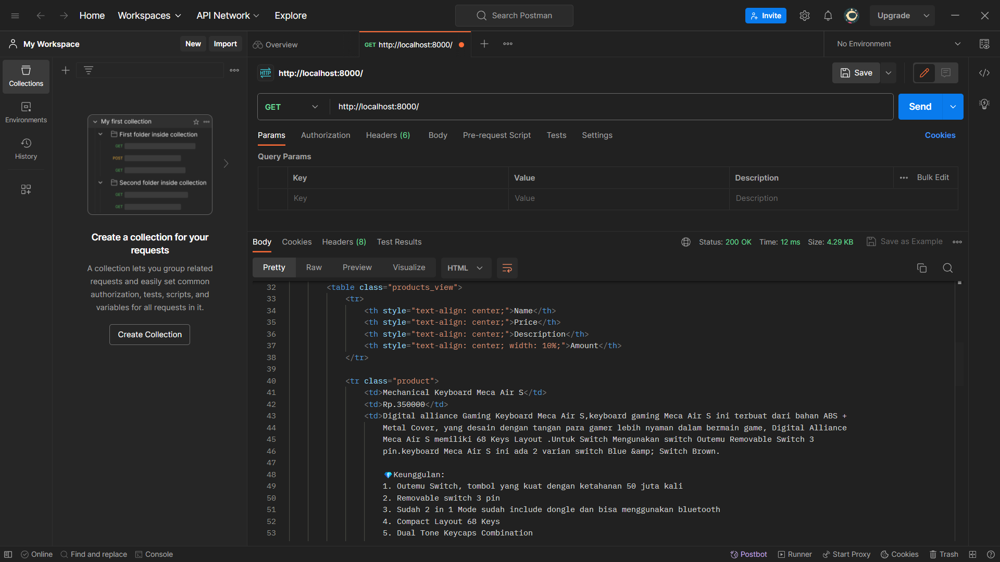

## Table of Content
1. [Tugas 1](#tugas-1)
1. [Tugas 2](#tugas-2)
2. [Tugas 3](#tugas-3)
3. [Tugas 4](#tugas-4)
4. [Tugas 5](#tugas-5)

## Tugas 1
[Contents](#table-of-content)

Essay Scele

## Tugas 2
[Contents](#table-of-content)
### 1. Impelementasi checklist.
Saya pergi ke repository lokal yang berisi tugas PBP dan menyiapkan satu folder untuk tugas-tugas yang berhubungan dengan github pada “PBP/GITHUB Connect”
Saya membuat virtual environment denan command ```python -m venv env```
Saya membuat project django app di dalam GITHUB Connect dengan menggunakan command ```django-admin startproject tokopaedi```


Setelah itu saya masuk ke direktori utama “/tokopaedi” untuk kemudian membuat app baru bernama main dengan menggunakan command ```django-admin startapp main```


Kemudian, saya melakukan setup pada settings.py agar semua HOST dapat mengakses project ini dan juga menginstall app main sehingga terdapat line berikut ini

```python
ALLOWED_HOST = [‘*’]

INSTALLED_APPS = [
    …
    …
   ‘main’,
]
```
Sehingga, app main berhasil di install dalam proyek tokopaedi


Kemudian, saya melakukan setup routing pada app main denganmenambahkan file "urls.py" pada app main sehingga terbentuk file baru "main/urls.py". File tersebut diisi dengan
```python
from django.urls import path
from main.views import show_main

# tugas 2: menjadikan main sebagai app
app_name = 'main'

# url untuk mengakses app main
urlpatterns = [
    path('', show_main, name='show_main'),
]
```
Setelah itu saya membuat path baru pada urls.py yang ada dalam direktori proyek untuk bisa mengakses file urls yang ada dalam app main, dengan menambahkan baris kode
```python
urlpatterns = [
    ...
    path('main/', include('main.urls')),
]
```
Kemudian, saya mempersiapkan models.py pada app main. Saya membuat sebuah class Product yang memiliki atribut name, price, amount, dan juga description. Tampilan class tersebut adalah seperti ini:
```python
class Product(models.Model):
    name = models.CharField(max_length=255)
    price = models.IntegerField()
    amount = models.IntegerField()
    description = models.TextField()
```
Untuk membuat tampilan utama app main saya membuat template dengan menyiapkan direktori baru bernama "main/templates/main" dan akan dibuat satu file main.html.

Langkah selanjutnya adalah mempersiapkan views.py pada app main yang dapat menghubungkan models.py dan juga file template pada "main/templates/main". Pada "main/views.py" saya menambahkan function show_main yang akan mengenerate models yang saya miliki ke "templates/main/main.html"
```python
# tugas 2: function untuk show app main
def show_main(request):
    context = {
        'name': 'Kursi Gaming',
        'price' : '2000000',
        'amount' : '1',
        'description' : 'Kursi Gaming dengan desain menyerupai mobil sport akan meningkatkan kemampuan coding anda sebanyak 250%'
    }
    return render(request, "main.html", context)
```
selanjutnya, saya melakukan migrasi model dengan menjalankan perintah ```python manage.py makemigrations``` dan ```python manage.py migrate```

### 2. Bagan request client ke web aplikasi


Pada bagan tersebut client melakukan request HTTP dan mengirimkannya ke Django melalui browser, request ini akan diarahkan ke tokopedia/urls.py untuk kemudian diteruskan ke views.py yang sesuai dengan request. views.py akan mengambil data melalui models.py dan kemudian me-render hasilnya dengan templates. Setelah proses tersebut selesai, views.py akan me-return HTTP response dan akan diberikan ke browser client.

### 3. Virtual environment
Dengan menggunakan virtual environment pada proyek Django, kita bisa mengeliminasi permasalahan dependency pada berbagai package yang dibutuhkan oleh proyek kita, dengan kata lain segala kebutuhan yang kita download hanya berpengaruh pada environment khusus tersebut dan kita tidak perlu melakukan download berkali-kali. Namun, kita tetap bisa membuat proyek Django tanpa menggunakan virtual environment degnan konsekuensi harus melacak setiap package yang ada dan akan menyusahkan kita sendiri terutama dalam melakukan kolaborasi dengan engineer lain.

### 4. Penjelasan tentang MVC, MVTM, dan MVVM
Baik MVC, MVT, maupun MVVM adalah arsitektur aplikasi yang bertujuan untuk memudahkan developer dalam mengelola aplikasi.
#### a. MVC
MVC adalah arsitektur yang membagi aplikasi menjadi 3 bagian utama yaitu Model, View, dan Controller. Model menjadi bagian yang bertanggung jawab untuk mengatur data yang ada seperti mengubah data sesuai dengan kebutuhan yang ada dan mengambil data dari database. View bertanggung jawab untuk mengatur tampilan aplikasi, biasanya berbentuk .html dalam web development. Controller bertanggung jawab untuk mengatur seluruh flow aplikasi terutama bagaimana data yang diberikan oleh Model dapat diteruskan ke View.
#### b. MVT
MVT adalah arsitektur yang membagi aplikasi menjadi 3 bagian utama yaitu Model, View, dan Template. Model pada MVT memiliki karakter yang sama dengan model pada MVC. View pada arsitektur MVT memiliki karakteristikk yang serupa dengan Controller pada arsitektur MVC. Sedangkan template, memiliki tanggung jawab yang sama dengan view pada MVC.
#### c. MVVM
MVVM adalah arsitektur yang membagi aplikasi menjadi 3 bagian utama yaitu Model, View, dan ViewModel. Dalam arsitektur MVVM, Model bertugas untuk mengelola logika bisnis yang ada, lalu ViewModel akan mengelola logika bisnis yang ada dan meneruskannya pada View untuk ditampilkan ke pengguna.

Perbedaan ketiganya adalah pada Impelemntasi pengelolaan arsitekturnya. Pada MVC, controller hanya bertugas untuk menghubungkan Model dan juga View. Pada MVT, View bertugas menerima HTTP request dan mengembalikan HTTP response. Pada MVVM fungsionalitas elemen pada View diatur sedemikian rupa oleh ViewModel.

## Tugas 3
[Contents](#table-of-content)
### 1. Perbedaan antara form `POST` dan `GET`

Perbedaan utama dari POST dan GET adalah tujuan dari implementasinya. Method POST digunakan untuk memasukkan data dari suatu form ke dalam server. Method POST juga mengirimkan datanya melalui request. Sehingga cocok untuk data yang penting seperti informasi password. Method GET umumnya digunakan untuk mengambil data dari server dan akan ditampilkan ke pengguna melalui URL, sehingga tidak cocok digunakan untuk mengambil data sensitif seperti password, karena akan terlihat di layar komputer.

### 2. Perbedaan utama antara XML, JSON, dan HTML dalam konteks pengiriman data

Perbedaan utama ketiga format tersebut adalah pada struktur data yang ditampilkan. XML menampilkan data sebagai susunan hirarkis dan menggunakan tag pembuka dan penutup untuk menampilkan data. JSON merepresentasikan data dengan menjadikannya sebagai object dan menampilkannya sebagai suatu key and value juga array. HTML menggunakan data untuk menampilkannya dalam tampilan website, HTML menggunakan tag pembuka dan penutup untuk setiap elemen yang ada dan bisa dilihat sebagai suatu susunan hirarkis keluarga, HTML tidak digunakan secara khusus dalam pengiriman data, tetapi digunakan untuk menampilkannya di layar komputer pengguna.

### 3. Alasan JSON sering digunakan dalam pertukaran data antara aplikasi web modern
Salah satu alasannya adalah JSON menggunakan format text yang dapat dipahami, sehingga engineer dapat dengan mudah memperbaiki kesalahan atau error yang ada. Alasan selanjutnya adalah JSON memiliki format data yang ringan, sehingga lebih efisien. JSON juga didukung banyak bahasa pemrograman sehingga secara tidak langsung memperbanyak penggunanya.

### 4. Impelementasi _checklist_
#### a. Membuat input `form` untuk menambahkan objek model pada app sebelumnya.
* Langkah pertama yang saya lakukan adalah dengan membuat file `forms.py` pada app main dan membuat class baru bernama `ProductForm` yang memiliki argumen `ModelForm`. Kemudian membuat inner class Meta dengan atribut model yang merupakan objek model `Product` dan fields yang akan dibuat dalam `ModelForm`.
* Selanjutnya, pada `views.py`, saya mengimplementasikan form yang ada melalui views untuk ditampilkan ke template yang sesuai. Cara mengimplementasikannya adalah dengan membuat function `create_product` yang akan mengembalikan form yang sudah valid ke dalam template yang sesuai.
#### b. Menambahkan 5 fungsi views untuk melihat objek yang sudah ditambahkan dalam format HTML, XML, JSON, XML by ID, dan JSON by ID.

* Saya menampilkan object product yang ditambahkan dengan format HTML menggunakan function show_main dengan menggunakan variable `products = Product.objects.all()` menjadi salah satu input (context) saat dikirimkan ke template yang sesuai. Pada template main.html, saya melakukan _looping_ untuk menampilkan setiap product dan data yang dimilikinya.

* Saya menampilkan object product yang ditambahkan dengan format XML dengan menambahkan fungsi baru dalam views.py yaitu show_xml dengan parameter request. Kemudian saya mengambil keseluruhan data dari Products untuk kemudian dijadikan argumen HttpResponse menggunakan Serializer yang sesuai. Untuk tampilan product dengan id tertentu, saya menggunakan fungsi yang serupa namun ditambahkan 1 parameter yaitu id. Argumen yang diberikan akan digunakan untuk menyaring data yang ada dalam Products sesuai dengan id yang diberikan.

* Pada format json, langkah yang saya lakukan sama dengan langkah untuk menampilkan data dengan format XML hanya saya, argumen 'xml' diganti dengan 'json' untuk bisa mendapatkan data dengan format json.

#### c. Membuat routing URL untuk masing-masing views yang telah ditambahkan pada poin 2.
* Pada format HTML, routing yang saya memanfaatkan urls main. Sehingga, tidak ada perubahan
* Dalam format XML dan JSON yang menampilkan keseluruhan data, saya menambahkan url yang sesuai untuk bisa menampilkan fungsi show yang berkaitan. Sedangkan untuk format yang menampilkan id tertentu, saya menggunakan `<int:id>/` sebagai url untuk bisa mendapatkan id yang akan dikirim ke fungsi show by id yang bersesuaian.

### 5. Mengakses kelima URL di poin 2 menggunakan Postman, membuat screenshot dari hasil akses URL pada Postman, dan menambahkannya ke dalam `README.md`
#### a. HTML

#### b. XML

#### c. XML by id

#### d. JSON

#### e. JSON by id


## Tugas 4
[Contents](#table-of-content)

### 1. Apa itu Django UserCreationForm, dan jelaskan apa kelebihan dan kekurangannya?
Django UserCreationForm() adalah salah satu tipe formulir yang disediakan oleh django. Formulir ini digunakan untuk membuat fitur pendaftaran pengguna dengan informasi dasar seperti username dan password. Django menjadikan UserCreationForm sebagai solusi dari fitur registrasi yang sering digunakan para developer. Adapun kelebihan dari UserCreationForm adalah sebagai berikut:
* Sederhana dan mudah digunakan karena Django sudah mempersiapkan logika pemrograman yang sesuai dengan kebutuhan umum
* Sudah terintegrasi dengan fitur keamanan yang ada pada Django, sehingga mampu memberikan keamanan yang lebih baik

Meskipun begitu, UserCreationForm juga memiliki kekurangan, antara lain:
* Kustomisasi menjadi lebih sulit karena karena membutuhkan pengaturan tertentu
* Tampilan formulir yang terbilang cukup standar
* Fungsionalitas yang sangat terbatas dikarenakan field yang ditawarkan hanya sebatas informasi dasar

### 2. Apa perbedaan antara autentikasi dan otorisasi dalam konteks Django, dan mengapa keduanya penting?
Autentikasi adalah sebuah proses untuk memverifikasi siapa yang sedang melakukan kegiatan dalam sistem. Contoh authentication adalah proses login. Sedangkan, authorization adalah proses untuk memberikan hak tertentu pada seorang user yang sudah di autentikasi. Hak ini meliputi fitur-fitur dan kegiatan tertentu yang bisa ia lakukan dalam suatu sistem .

### 3. Apa itu cookies dalam konteks aplikasi web, dan bagaimana Django menggunakan cookies untuk mengelola data sesi pengguna?
Cookies adalah teknik penyimpanan data web yang berukurang relatif kecul. Cookies sering digunakan sebagai alat untuk membuat fitur session dimana seorang pengguna yang sama tidak perlu melakukan proses autentikasi berkali-kali untuk menggunakan fitur tertentu yang ada dalam website.

Secara umum ,ada dua jenis cookies, yaitu temporary cookie dan *persistent cookie* (data disimpan dalam sebuah file) yang bisa digunakan dalam jangka panjang. Django memberikan kemudahan dalam penggunaan cookies dan sudah menyiapkan beberapa perintah yang sudah di enkapsulasi dalam sebuah function seperti set_cookie dan delete_cookie. Function tersebut bisa diimplementasikan dalam Views yang ada dalam proyek atau aplikasi django.

### 4. Apakah penggunaan cookies aman secara default dalam pengembangan web, atau apakah ada risiko potensial yang harus diwaspadai?
Cookie hanya menyimpan data dan bukan kode program sehingga tidak bisa menghapus atau merusak *data storage* pengguna. Cookies juga umumnya bersifat anonimus dan tidak menyimpan informasi personal. Namun, penggunaan cookies juga memiliki celah keamanan. Penggunaan cookies beresiko untuk mengalami pencurian sesi (*session hijacking*), sehingga pengguna yang tidak terotorisasi bisa menggunakan sesi tersebut untuk sesuatu yang merugikan.

### 5. Implementasi Checklist
#### a. Mengimplementasikan fitur registrasi, login, dan logout
* Registrasi <br>
Menambahkan fitur registrasi. Oertama saya menambahkan *function* register pada `views.py` yang berisi pengisian form UserCreationForm(). Selanjutnya menambahkan tempatlate untuk registrasi dengan membuat file html `register.html` berisi form yang diambil dari *context* dari `views.py`. Setelah View dan Template dari fitur registrasi selesai dibuat, selanjutnya melakukan routing pada `main/urls.py`.
* Login<br>
Dengan langkah serupa dengan pembuatan fitur registrasi, pembuatan fitur login dimulai dari pembuatan view, kemudian template, lalu routing url.
* Logout<br>
Dalam pembuatan fitur logout sama dengan pembuatan fitur registrasi dan login. Namun pada fitur logout tidak perlu membuat file html baru, cukup menambahkan tombol logout pada `main.html`.
* Restriksi halaman main<br>
Pada `views.py` ditambahkan `@login_required` diatas *function* show_main() yang diarahkan ke fungsi login, sehingga halaman main hanya bisa diakses setelah kita login.

#### b. Membuat dua akun pengguna dengan masing-masing **3** *dummy data* menggunakan model yang telah dibuat pada aplikasi sebelumnya setiap akun **di lokal**
Menambahkan akun dan data dengan menggunakan fitur yang ada
* User 1: cicakbinkadal<br>

* User 2: pacilians<br>


#### c. Menghubungkan model `Item` dengan `User`
Pertama, import User yang ada dalam auth.models pada `models.py` dan menambahkan variabel user pada Product sehingga setiap produk dimiliki oleh satu user. Selanjutnya memodifikasi fungsi create_product dengan menambahkan atribut user pada produk tersebut sesuai dengan user yang melakukan request.
Lalu saya ubah fungsi `show_main` dengan melakukan filter pada list produk yang ditampilkan. Terakhir, melakukan migrasi model dengan perintah `python manage.py makemigrations` dan `python manage.py migrate`.

#### d. Menampilkan detail informasi pengguna yang sedang *logged in* seperti *username* dan menerapkan `cookies` seperti `last login` pada halaman utama aplikasi.
Pada fungsi `show_main` kita tambahkan input berupa cookies bernama 'last_login' yang sudah dibuat sebelumnya dan memasukkannya dalam context untuk diteruskan ke `main/main.html`. Kemudian pada template `main.html` kita membuat informasi pengguna yang sedang dalam sesi yaitu nama dan juga waktu login.

### 6. Bonus
#### a. Fitur increament dan decreament produk
Untuk membuat fitur increament dan decreament amount produk saya membuat fungsi baru pada `views.py` yaitu dengan `update_amount`. Di dalam fungsi tersebut, saya membagi kasus menjadi 2 yaitu increase dan decrease amount. Kemudian saya menambahkan simbol '+' dan '-' disamping amount setiap product dengan menggunakan tag html a dan mengarahkannya pada url untuk memanggil fungsi `update_amount`. Kemudian saya melakukan routing pada `main/urls.py` dan menambahkan url yang menerima id product dan juga action yang dilakukan.
#### b. Fitur remove produk
Untuk membuat fitur delete produk, saya melakukan hal yang serupa dengan pembuatan fitur increment dan decrement. Perbedaannya adalah saya menambahkan fitur konfirmasi pada `main.html` untuk mencegah kasus 'penghapusan produk' yang tidak diinginkan.

## Tugas 5
[Contents](#table-of-content)

### 1. Jelaskan manfaat dari setiap *element selector* dan kapan waktu yang tepat untuk menggunakannnya
Element selector adalah salah satu jenis selector pada CSS yang memungkinkan kita menargetkan elemen HTML tertentu sehingga menjadi salah satu selector yang banyak digunakan dalam styling HTML secara umum karena cakupannya yang cukup besar. Waktu yang tepat untuk menggunakan element selector adalah ketika kita ingin mengubah gaya suatu tag HTML secara keseluruhan. Contoh:

```CSS
/* Mengubah font semua paragraf */
p {
    font-family: Arial, sans-serif;
}

/* Membuat margin dan padding untuk elemen body, header, dan paragraf */
body, h1, h2, h3, h4, p {
    margin: 0;
    padding: 0;
}
```

Besarnya cakupan dari *element selector* menyebabkan ia tidak cocok untuk digunakan ketika kita ingin mengubah sautu tag HTML khusus. Sehingga, dalam kasus elemen khusus tertentu lebih baik menggunakan selector lain seperti *ID selector* atau *Class selector*.

### 2. Jelaskan HTML5 Tag yang kamu ketahui
Tag HTML yang baru ada HTML5 misalanya sebagai berikut:<br>
1. `<audio>` dan  `<video>`<br>
HTML5 memungkinkan kita untuk menambahkan audio maupun video secara langsung pada halaman web tanpa harus menggunakan aplikasi pihak ketiga.
2. `<header` dan `<footer>`<br>
HTML5 memiliki tag header dan footer yang memungkinkan pengembang web tidak perlu lagi menggunakan tag HTML yang lebih umum seperti `<div>`, sehingga menambah readibility pada file HTML.
3. `<nav>`<br>
HTML5 juga memiliki tag `<nav>` untuk mengelompokkan elemen HTML yang dibangung untuk membuat navigasi pada website. Tag `<nav>` mempermudah para pengembang web dalam membangun web dengan meningkatkan readibilitas file HTML. 


### 3. Jelaskan perbedaan antara margin dan padding
Margin adalah batas luar yang memisahkan sautu elemen HTML dengan elemen HTML lainnya. Margin memberikan pengaruh pada jarak antar elemen yang ada. Kita bisa mengontrol jarak antara elemen-elemen di luar suatu elemen.

Di lain sisi, padding adalah batar dalam yang memberikan jarak pada suatu elemen HTML terhadap *content* yang dimilikinya.

Jika kita menambahkan border pada suatu elemen HTML, margin adalah bagian kosong yang berada di luar border elemen HTML, sedangkan padding adalah bagian kosong yang ada di dalam border elemen HTML. Sehingga, dapat disimpulkan perbedaan antara margin dan padding adalah margin memberikan jarak antara suatu elemen dengan elemen lainnya, sedangkan padding memberikan jarak antara batas luar (border) sautu elemen HTML dengan `content` yang ada di dalamnya.

### 4. Jelaskan perbedaan antara *framework* CSS Tailwind dan Bootstrap. Kapan sebaiknya kita menggunakan Bootstrap daripada Tailwind, dan sebaliknya?
#### a. Tailwind
Tailwind adalah salah satu framework CSS yang berfokus pada kelas-kelas utilitas yang spesifik dan telah didefinisikan sebelumnya. Framework ini memberikan fleksibilitas kepada pengembang web karena bekerja pada bagian-bagian terkecil pada HTML yang sudah dikelompokkan pada kelas-kelas tertentu. Tailwind memerlukan pemahaman yang cukup terhadap CSS untuk bisa melakukan kustomisasi yang baik dan sesuai dengan keinginan kita. Tailwind juga memiliki file CSS yang sedikit lebih kecil dibandingkan dengan bootstrap karena hanya memuat kelas-kelas yang dinginkan saja.
#### b. Bootstrap
Bootstrap adalah jenis framework CSS lain yang sering digunakan oleh pengembang web. Bootstrap memberikan *template* HTML yang sudah lengkap dan bisa digunakan langsung pada aplikasi. Bootstrap akan memberikan tampilan yang lebih konsisten karena menggunakan komponen-komponen yang sama yang telah didefinisikan sebelumnya. Framework ini juga tidak memerlukan pemahaman yang dalam terhadap CSS sehingga lebih *friendly* untuk pengembang web yang masih dalam tahap belajar. Selain itu, Bootstrap memiliki ukuran file yang lebih besar dibandingkan dengan Tailwind karena memiliki banyak komponen yang harus didefinisikan.

### 5. Jelaskan bagaimana cara kamu mengimplementasikan *checklist* di atas secara *step-by-step*
Langkah pertama yang saya gunakan adalah membuat file css baru yang akan digunakan untuk mengubah tampilan login page. Kemudian melakukan kustomisasi terhadap setiap elemen yang ada.

### 6. Bonus
Menggunakan fitur last-child pada CSS dan diterapkan pada tr yang ada pada table di main.html